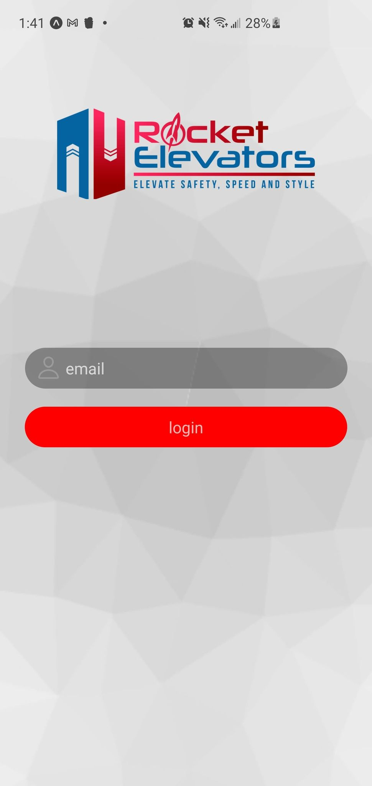
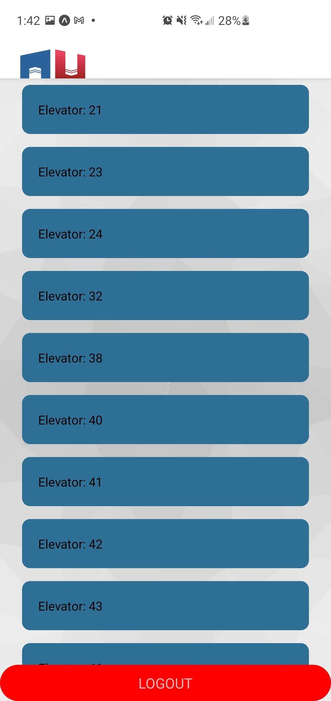
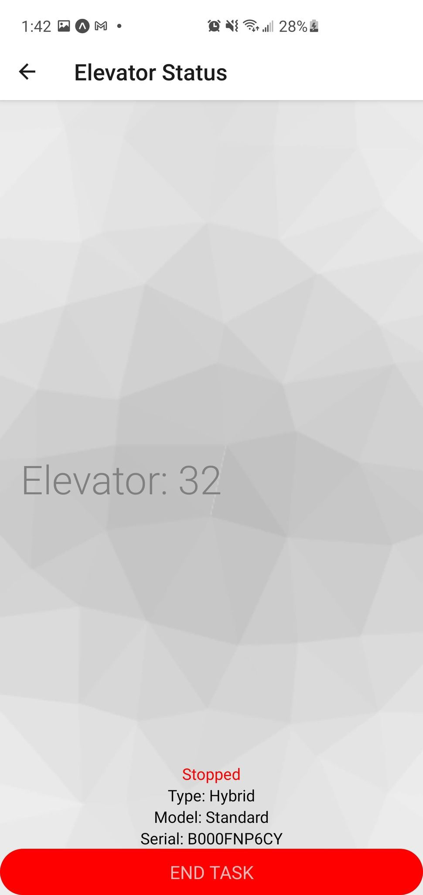
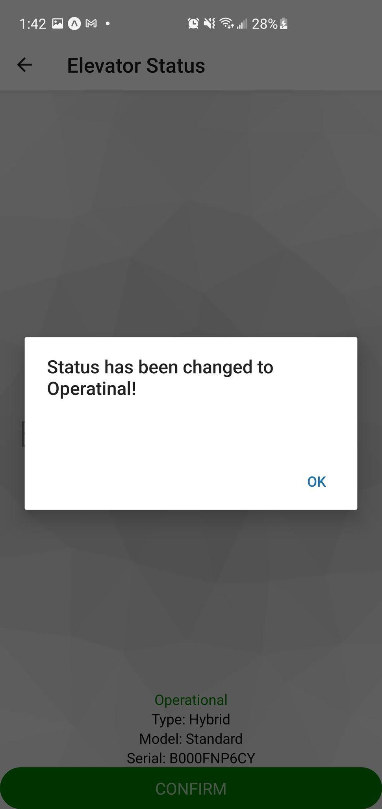

# Rocket-Elevators-Mobile

For the final week of Codeboxx, we had to develop a mobile app with our framework of choice. I chose to use React Native as it is powerful and has great community support. 

The components:

- Startup Screen
- Home Screen
- Elevator Status Screen

**Startup Screen:**

The application starts by asking for an employee's email address. A verification of the entered address is done among the list of the company's employees. If the employee's email exists among the list the user of the App is directed to a home screen, otherwise, the user is told that the email entered is not the email of a listed agent.

**Home Screen:**

The welcome screen lists all the elevators that are not in operation and allows you to select one of them. When selecting an elevator from the list, the user is directed to a screen displaying the status of the selected elevator.

**Elevator Status Screen**

When an elevator is selected from the list, a query is made for its current status and the status is displayed on the screen. On this screen, you can see the status of the elevator changing accordingly. When the status becomes operational, it is displayed in green. For non-operational statuses, the status is displayed in red.

 
When the button is pressed, a request is sent to update the status of the elevator to its operational status. 
Once the status update is complete, the screen queries the elevator status again. If the status is actually returned to an operational status, a required button is displayed below the status to allow you to return to the home screen.

